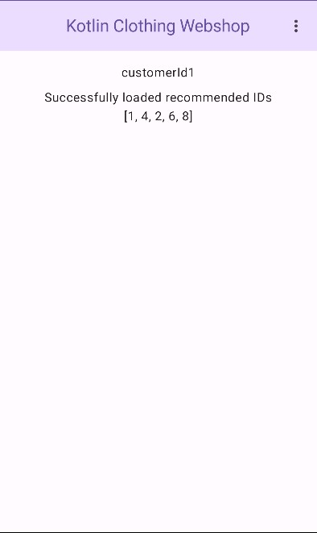

# Kotlin Clothing Webshop

[](http://kotlinlang.org)
[](https://github.com/Balintus00/kotlin-clothing-webshop/blob/master/LICENSE.txt)

## Kotlin Multiplatform Sample Application

Kotlin Clothing Webshop is Kotlin Multiplatform application. My main goal with the project to learn more and
show that how Kotlin Multiplatform can be used to create complex applications. The project includes:

- A backend created with [ktor](https://ktor.io/), providing a [GraphQL](https://graphql.org/) API, generating
  recommendations using [KotlinDL](https://github.com/Kotlin/kotlindl) with an [ONNX model](https://onnx.ai/),
  persisting data into a [PostgreSQL](https://www.postgresql.org/) database using
  [R2DBC API](https://github.com/r2dbc/r2dbc-spi), with asynchronous code implemented with
  [Kotlin Coroutines](https://kotlinlang.org/docs/coroutines-overview.html). The backend and the database
  management system it uses can be run with [Docker compose](https://www.docker.com/).
- A [Kotlin Multiplatform](https://www.jetbrains.com/help/kotlin-multiplatform-dev/get-started.html) client with common
  [Compose Multiplatform](https://www.jetbrains.com/lp/compose-multiplatform/) user interface, and GraphQL communication
  implemented with [Apollo Kotlin](https://github.com/apollographql/apollo-kotlin) library.
- An exploratory data analysis
  [Kotlin Notebook](https://blog.jetbrains.com/kotlin/2023/07/introducing-kotlin-notebook/).
- An IPython (Jupyter) Notebook containing recommendation system model inspection created with
  [Pandas](https://pandas.pydata.org/), [PyTorch](https://pytorch.org/), [Weights and Biases](https://wandb.ai/site).

### Current project status

Currently, the repository contains an implementation of the proof of concept demo version of the webshop application.



### Future plans

The next release (1.0.0) will contain:

- Basic authentication and user management
- Clothing article browsing

And the following release (1.1.0) will contain:

- Improvements to the recommendation model inspection Jupyter Notebook
- Update of the usage of the recommendation model on the backend

### Installation Requirements

#### Requirements to run the backend

The easiest way to run the backend is run it with [Docker Compose](https://www.docker.com/) using the project's
[docker-compose.yaml](docker-compose.yaml) file.

#### Requirements to run the Android, JVM Desktop application

Both the Android and JVM application requires
[JDK 17](https://www.oracle.com/java/technologies/javase/jdk17-archive-downloads.html) to be installed. To build and
install the Android application it is also recommended to
install [Android Studio](https://developer.android.com/studio).

#### Requirements to run the Web application

To run the web application, you need to have a browser installed with
[WebAssembly Garbage Collection Support (WasmGC)](https://github.com/WebAssembly/gc). Please refer to the [related
official site](https://webassembly.org/features/) for more information about supported browsers.

#### Requirements to run the iOS application

To check that you have the required dependencies to build and run the iOS application, use the
[KDoctor](https://github.com/Kotlin/kdoctor) tool.

#### Requirements to run the Kotlin Notebook

Install [IntelliJ IDEA](https://www.jetbrains.com/idea/) and install and enable
the [Kotlin Notebook](https://plugins.jetbrains.com/plugin/16340-kotlin-notebook)
and [Jupyter](https://plugins.jetbrains.com/plugin/22814-jupyter) IntelliJ IDEA plugins.

#### Requirements to run the IPython Notebook

Install Python, and the dependencies declared in [requirements.txt](notebooks/requirements.txt), and a IPython (Jupyter)
Notebook editor software, e.g. [PyCharm](https://www.jetbrains.com/pycharm/).

### Usage

This section provides instructions on how to use the project, including commands to create artifacts or run it. The only
supported setup of the system is when the backend and the client application is running on the same host, or in the case
mobile applications when the simulator and emulator is running on the same host.

#### 1. Backend

Firstly, you must ensure that are project level files are copied to appropriate places into the backend module. The
recommended to do this, is to run a simple script
file ([Windows](backend/copy_required_content_from_root_project_for_docker.cmd),
[macOS](backend/copy_required_content_from_root_project_for_docker.sh)). After this, you can use the
[Docker plugin for JetBrains IDEs](https://plugins.jetbrains.com/plugin/7724-docker), or the command below with the
project's [docker-compose.yaml](docker-compose.yaml) file:

```
docker compose up -d
```

The backend will be available on http://localhost:5400 and the PostgreSQL database on http://localhost:5432.

#### 2. Clients (Android, JVM Desktop, iOS, Web application)

Before the client applications could be built, the GraphQL schema must be downloaded to the required place. The easiest
way to do this, is to run the *downloadKotlinClothingWebshopApolloSchemaFromIntrospection* gradle task. Before running
the task, make sure that the backend is running.

- Android application
    - The easiest way to run the **android** configuration in Android Studio. But you can also use gradle tasks from IDE
      or
      using the [gradlew](gradle/wrapper) to generate an apk:

      ```
      ./gradlew android:assemble
      ```

      The apk will be generated in *android/build/outputs/apk/*, and in that folder for each build type (currently debug
      and
      release is defined) there will be a folder that will contain the apk built with the related build type. And then
      this
      apk can be installed onto the running emulator using [adb](https://developer.android.com/tools/adb)
      with following command:

      ```
      adb install android-debug.apk
      ```
- JVM Desktop application
    - To run the JVM Desktop application run the *desktop:run* gradle task.
- iOS application
    - Open the Xcode project from the *iosApp* folder, and build and run it using Xcode.
- Web application
    - To run the Web application run the *wasmWebClient:wasmJsBrowserRun* gradle task.

#### 3. Kotlin Exploratory Data Analysis Notebook

Open the [notebook](notebooks/hm_dataset_inspection_eda.ipynb) in IntelliJ IDEA.

#### 4. Model experimentation IPython Notebook

Open your [notebook](notebooks/two_tower_model_clothing_recommendation_system.ipynb) with your preferred Jupyter
Notebook editor tool.

### Versioning

This project follows the principles of [Semantic Versioning (SemVer)](https://semver.org/).

### Contributing

Thank you for your interest in contributing to this project! At the moment, the repository is not open to external
contributions. However, this may change in the future as the project evolves. Stay tuned for updates!